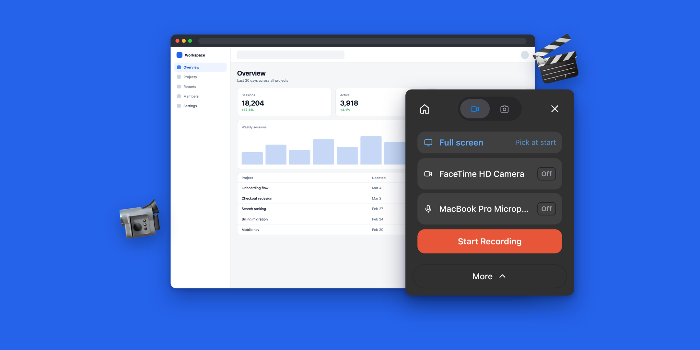

<div align="center">
  <picture>
    <source media="(prefers-color-scheme: dark)" srcset="apps/web/public/brand-mark-light.svg" />
    
  </picture>
  <h1>CaptureFlow</h1>
  <p>
    <strong>Open-source, self-hostable screen recording with instant shareable links.</strong>
  </p>
  <p>
    <a href="https://captureflow.dev">Website</a>
    &nbsp;·&nbsp;
    <a href="https://captureflow.dev/download">Download</a>
    &nbsp;·&nbsp;
    <a href="https://docs.captureflow.dev">Docs</a>
    &nbsp;·&nbsp;
    <a href="./DEPLOY.md">Self-hosting</a>
    &nbsp;·&nbsp;
    <a href="./LICENSE">License</a>
  </p>
  <p>
    <a href="./LICENSE"></a>
    
    <a href="https://github.com/sardorml/captureflow/stargazers"></a>
  </p>
  <br />
  
</div>

<br />

CaptureFlow records your screen and hands you a share link the moment you stop.
It records from two places — an MV3 browser extension and a native macOS app —
onto one Cloudflare-hosted backend that serves the dashboard, the recording and
screenshot viewers, and the API. It's fully open source (AGPL-3.0) and
self-hostable on your own Cloudflare account — **every feature ships in the
open-source build**.

The upload runs while you record, so stopping is the last step: no export
queue, no render wait. Screenshots come from the same panel and share the same
links, dashboard, and retention rules as recordings.

## Monorepo layout

```
apps/
  web/         Next.js 16 dashboard + recording/screenshot pages + API → Cloudflare Workers (OpenNext)
  extension/   Browser recorder (WXT, MV3) — popup/overlay panel, offscreen capture, in-page controls
  desktop/     Electron screen recorder (macOS)
  docs/        VitePress documentation site → its own Cloudflare Worker (assets-only)
packages/
  engine/      Capture engine shared by desktop + extension: macOS sidecars, record protocol, mux pipeline (MIT)
  shared/      Types & constants shared across the apps
  ui/          Theme tokens + the React components with no HeroUI equivalent
  quota/       Storage quota, limits & workspace logic
```

Apps depend on packages, never the reverse, and never on each other.

## Requirements

- Node.js >= 24.13
- pnpm 10 (`corepack enable && corepack prepare pnpm@10.30.0 --activate`)
- A Cloudflare account for the web app (Workers + D1 + R2)
- Swift (Xcode command-line tools) only if you change the macOS capture
  sidecars — the built binaries are committed, so nothing else needs it

## Develop

```bash
pnpm install
pnpm dev                                  # run everything
pnpm web                                  # just the dashboard
pnpm extension                            # just the browser extension
pnpm --filter @captureflow/desktop dev    # just the desktop recorder
```

Repo-wide checks:

```bash
pnpm typecheck
pnpm --filter @captureflow/web test
pnpm format
```

After editing the Swift sidecars, rebuild them — the app loads the committed
binaries, not the sources:

```bash
packages/engine/scripts/build-native.sh              # arm64
packages/engine/scripts/build-native.sh --universal  # arm64 + x86_64
```

### Load the extension

It isn't on the Chrome Web Store yet. `pnpm extension` launches a browser with
it loaded; for a persistent install, build it and load the folder unpacked:

```bash
pnpm extension:build   # → apps/extension/.output/chrome-mv3
```

Then in `chrome://extensions` turn on Developer mode → **Load unpacked** →
pick `apps/extension/.output/chrome-mv3`.

## Deploy the web app to Cloudflare

[](https://deploy.workers.cloudflare.com/?url=https://github.com/sardorml/captureflow)

Or manually:

```bash
# one-time: create the bindings
wrangler d1 create captureflow
wrangler r2 bucket create captureflow-recordings
# paste the returned ids into apps/web/wrangler.jsonc, then:
pnpm --filter @captureflow/web db:apply:remote
pnpm --filter @captureflow/web cf:deploy
```

[`DEPLOY.md`](./DEPLOY.md) is the full runbook — secrets, auth providers, the
custom domain, and pointing the recorders at your own instance.

## License

[AGPL-3.0-only](./LICENSE), with one exception: the reusable capture engine in
[`packages/engine`](./packages/engine) is [MIT-licensed](./packages/engine/LICENSE).
Combined builds (the desktop app, the browser extension) are AGPL-3.0-only as a
whole.
